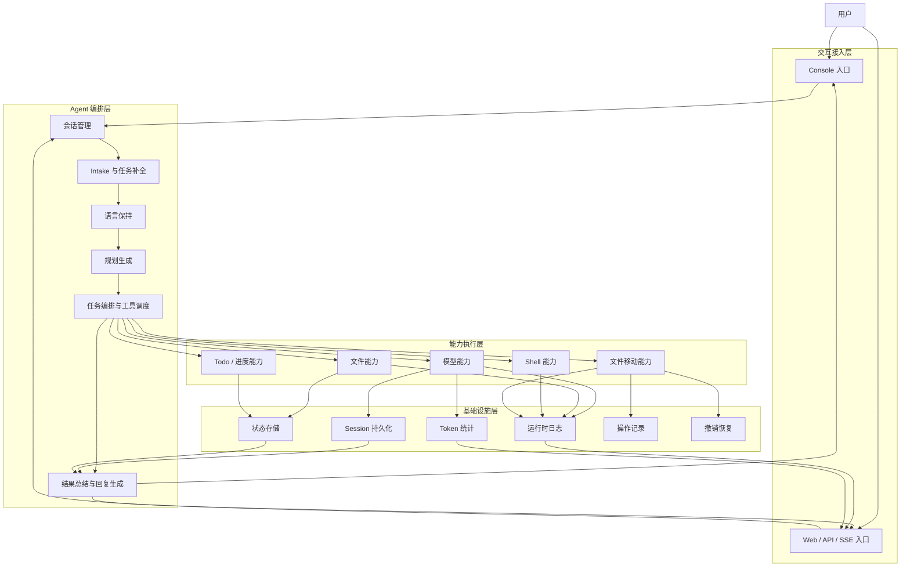
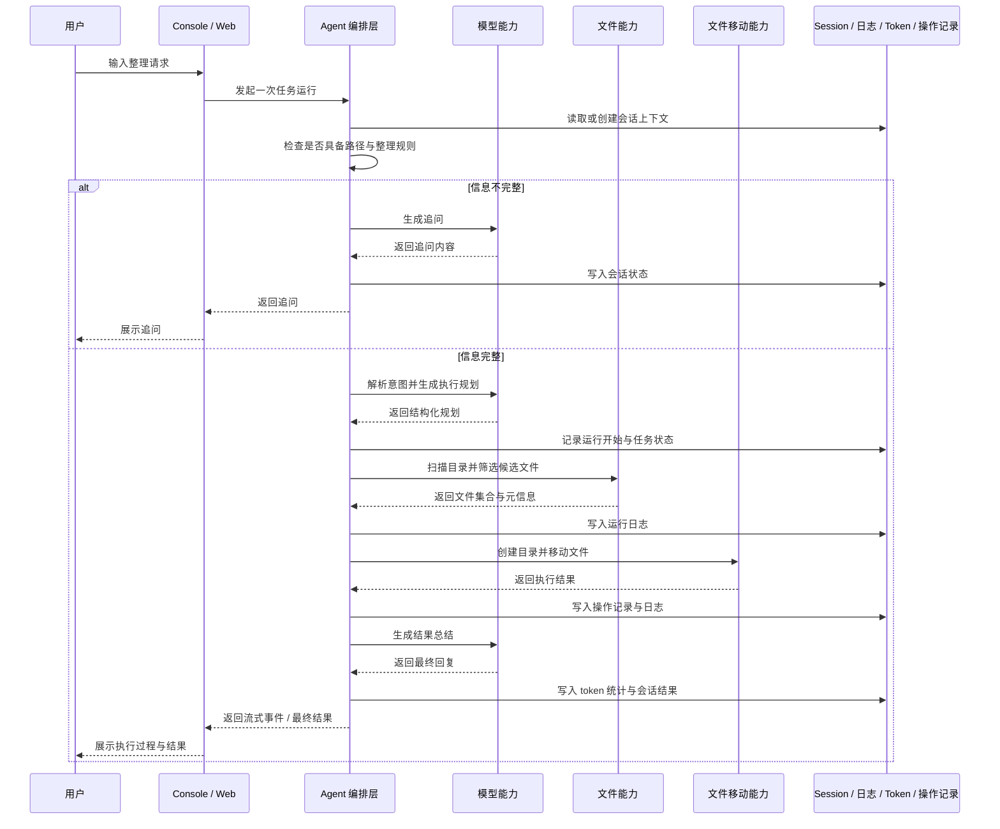

# 智能文件整理 Agent 技术方案

## 1. 方案概述

本方案用于构建一个面向本地文件整理场景的智能 Agent 系统。用户通过自然语言提出整理需求，系统自动完成任务理解、目标目录识别、规则补全、执行规划、文件操作、过程反馈和结果审计，形成从输入到执行再到回溯的完整闭环。

系统支持两类运行形态：

- Console 交互模式
- Web 服务模式

方案关注的核心目标包括：

- 自然语言驱动的文件整理能力
- 多轮补全式任务交互
- 流式输出与过程可视化
- 统一的运行时日志与 token 统计
- 文件操作可追踪、可回退
- 具备持续产品化演进能力的分层架构

---

## 2. 建设目标

### 2.1 业务目标

构建一个能够理解用户整理意图并实际执行文件整理动作的智能 Agent，使用户无需掌握命令行或固定规则模板，只需通过自然语言描述，即可完成本地文件归类与归档。

### 2.2 技术目标

- 建立统一的 Agent 编排与执行框架
- 支持会话化、多轮补全式交互
- 支持 Console 与 Web 双入口
- 支持真实流式响应而非一次性返回
- 支持工具调用过程暴露与运行时日志
- 支持输入/输出 token 统计
- 支持文件操作记录与撤销恢复

---

## 3. 适用场景

本方案适用于以下典型场景：

- 下载目录自动整理
- 按扩展名归类图片、文档、表格、压缩包
- 按时间归档历史文件
- 按文件大小分组大文件
- 按多维规则整理文件，例如“把今年的 Excel 文件按大小分类”
- 面向个人用户的桌面文件管理助手
- 面向浏览器端产品化接入的文件整理后台服务

---

## 4. 总体架构

系统采用分层架构设计，自上而下分为四层：

- 交互接入层
- Agent 编排层
- 能力执行层
- 基础设施层

各层职责清晰，交互与执行解耦，业务控制与底层支撑分离，从而保证系统既适合本地调试，也具备服务化部署能力。

### 4.1 交互接入层

交互接入层负责承接用户请求并返回执行过程与结果，当前包含：

- Console 入口
- Web / API / SSE 入口

该层主要负责：

- 接收用户输入
- 启动一次任务运行
- 处理流式事件展示
- 向用户返回最终结果

### 4.2 Agent 编排层

Agent 编排层是系统核心控制中枢，负责将自然语言请求转化为结构化整理任务，并决定如何执行。

该层主要包括：

- 会话管理
- Intake 与任务补全
- 语言保持
- 整理意图识别
- 规划生成
- 工具调度
- 结果总结与回复生成

### 4.3 能力执行层

能力执行层负责提供实际执行能力，由多个模块组成：

- 模型能力
- 文件能力
- Shell 能力
- 文件移动能力
- Todo / 进度能力

这些能力由 Agent 编排层按需调用，完成具体执行动作。

### 4.4 基础设施层

基础设施层为系统提供统一支撑，包括：

- Session 持久化
- 状态存储
- 运行时日志
- Token 统计
- 操作记录
- 撤销恢复

这一层主要承担可靠性、可观测性和可恢复性职责。

---

## 5. 分层架构图

### 5.1 架构图说明

该架构图表达的是一次用户请求在系统中的整体流动路径。

1. 用户通过 Console 或 Web 发起请求。
2. 请求首先进入会话管理模块，用于创建或恢复上下文。
3. Intake 模块判断当前输入是否具备执行条件。
4. 若任务信息不足，则进入任务补全与追问流程。
5. 当路径和整理规则完整后，规划模块生成内部执行计划。
6. 编排模块根据计划调用模型、文件、Shell、移动和 Todo 等能力模块。
7. 执行过程中的状态、日志、token 和操作记录持续落入基础设施层。
8. 最终由结果总结模块输出用户可读结果，并返回到 Console 或 Web。

---

## 6. 核心流程设计

### 6.1 会话初始化

系统为每次用户交互创建或恢复会话上下文，会话中保存以下关键信息：

- 历史对话
- 当前待补全任务信息
- 已识别路径
- 已识别整理规则
- 会话偏好语言
- 中间执行状态

该机制保证系统能够支持多轮连续交互，而不是依赖用户一次性输入完整需求。

### 6.2 任务 Intake

系统首先判断当前输入是否已经具备执行条件。整理任务至少需要识别两类核心信息：

- 目标目录路径
- 整理规则或整理目标

若任一信息缺失，系统将通过自然语言继续追问，直到形成可执行任务。

### 6.3 语言保持机制

系统在会话级维护回复语言偏好，而不是只根据当前这一条输入判断语言。

该机制能够解决如下问题：

- 中文会话中单独输入英文路径时，回复不应切换为英文
- 多轮任务补全过程中回复语言应保持稳定

### 6.4 整理意图识别

当路径和规则逐步补全后，系统将自然语言请求转换为结构化整理任务。支持的整理方式包括：

- 按扩展名分类
- 按时间分类
- 按文件大小分类
- 按命名模式分类
- 按多条件组合分类

示例：

- 按扩展名整理
- 按月份归档图片
- 把大文件单独移动到归档目录
- 把今年的 Excel 文件按大小分类

### 6.5 执行规划生成

在真正进行文件操作前，系统先生成内部规划，用于明确：

- 扫描范围
- 规则匹配逻辑
- 目标目录结构
- 待处理文件集合
- 目录创建需求
- 文件移动顺序
- 结果验证方式

该阶段的目标是确保执行具备可解释性和稳定性。

### 6.6 执行阶段

规划完成后，系统通过工具编排方式依次完成：

- 扫描目录
- 筛选目标文件
- 读取文件元信息
- 创建目标目录
- 执行文件移动
- 更新进度状态
- 写入操作记录

执行过程不是黑盒，系统会持续向上游暴露关键运行事件。

### 6.7 结果输出

任务执行完成后，系统返回整理结果摘要，包括：

- 完成了哪些整理动作
- 处理了多少文件
- 目标目录结构发生了哪些变化
- 是否存在未处理项或失败项
- 后续可继续执行的建议

### 6.8 撤销与恢复

系统记录关键文件移动操作，用于支持撤销逻辑，适用于：

- 用户误操作
- 规则设置不合理导致的误分类
- 批量整理后的快速回滚

---

## 7. 核心时序图

### 7.1 时序图说明

该时序图体现了整理任务的主干处理路径。

1. 用户请求进入系统。
2. Agent 首先判断任务是否完整。
3. 若信息不足，则调用模型生成追问。
4. 若信息完整，则进入意图解析和规划阶段。
5. 规划完成后，Agent 调用文件能力获取候选文件及元信息。
6. 随后调用移动能力执行目录创建和文件移动。
7. 整个过程中，基础设施层持续记录状态、日志、token 和操作记录。
8. 最终由模型生成结果总结，并通过 Console 或 Web 返回给用户。

---

## 8. 交互模式设计

### 8.1 Console 模式

Console 模式主要用于本地交互和开发调试，特点包括：

- 即时文本交互
- 工具执行过程可见
- Todo 变化可见
- Token 用量可见
- 流式输出直观

该模式适合能力验证、问题定位和本地使用。

### 8.2 Web 模式

Web 模式主要用于浏览器访问和服务化部署，特点包括：

- 通过服务端接口提供能力
- 支持事件流式返回
- 支持前端实时展示执行过程
- 支持后端标准输出日志

该模式适合后续产品化接入与多终端扩展。

---

## 9. 流式输出设计

系统支持真正的流式响应能力，分为两部分：

### 9.1 文本流式

模型生成的文本按增量逐步返回，用户无需等待全部内容生成完成即可看到结果。

### 9.2 事件流式

系统在运行过程中将关键事件逐步向上游暴露，例如：

- 模型开始生成
- 工具开始执行
- 工具执行完成
- 最终响应完成

在 Web 场景下，前端可以根据这些事件判断系统当前所处阶段以及一轮任务是否结束。

---

## 10. Token 统计设计

系统统一记录模型调用的 token 消耗，包括：

- 输入 token
- 输出 token
- 总 token

该能力主要服务于以下目标：

- 成本监控
- 性能分析
- 模型调用行为观察
- 用户侧或运维侧展示

在 Console 模式下，token 信息直接输出给用户；在 Web 模式下，token 信息通过运行时日志输出，并可进一步扩展到前端展示或监控系统。

---

## 11. 运行时日志设计

系统在关键运行节点提供统一日志能力，用于增强可观测性。日志主要覆盖：

- 用户请求进入
- 一次运行开始与结束
- 模型调用开始与结束
- 工具调用开始与结束
- 最终输出摘要
- Token 用量
- 错误信息

该机制主要解决以下问题：

- 工具执行时看起来像卡住
- Web 后台运行过程不可见
- 难以定位模型或工具异常
- 难以复盘一次整理任务的执行链路

---

## 12. 状态与持久化设计

系统采用会话化状态设计，保存多轮任务补全过程中的上下文信息。其核心价值在于：

- 保持连续对话
- 支持未完成任务继续补全
- 保存会话偏好语言
- 保存中间任务状态
- 支持运行结果追溯

同时，关键文件操作会单独记录，用于支撑撤销恢复。

---

## 13. 模块职责表

| 模块 | 职责 |
|---|---|
| Console / Web 接入 | 接收请求、展示流式过程、返回最终结果 |
| 会话管理 | 保存上下文、恢复多轮状态、承接连续对话 |
| Intake 与任务补全 | 判断路径和规则是否完整，必要时继续追问 |
| 语言保持 | 保持多轮会话中的稳定回复语言 |
| 规划生成 | 将自然语言需求转化为结构化整理计划 |
| 任务编排 | 调用模型与工具，控制执行顺序 |
| 模型能力 | 理解意图、生成追问、生成结果总结 |
| 文件能力 | 扫描目录、筛选文件、读取元信息 |
| 文件移动能力 | 创建目录、执行移动、记录变更 |
| Todo / 进度能力 | 跟踪任务阶段和执行进度 |
| Session / 状态存储 | 保存会话数据与中间状态 |
| 运行时日志 | 记录关键过程事件与异常信息 |
| Token 统计 | 统计输入、输出和总 token 消耗 |
| 操作记录 / 撤销 | 保存文件变更记录并支持回退 |

---

## 14. 关键设计原则

### 14.1 自然语言优先

用户通过自然表达即可发起整理任务，而不需要预先掌握命令格式或系统语法。

### 14.2 先理解再执行

系统优先完成意图识别和任务补全，再进入执行阶段，避免在需求不完整时直接进行文件操作。

### 14.3 过程透明

系统尽可能向用户和运维侧暴露关键执行过程，减少“看不到内部状态”的不确定性。

### 14.4 可回退

文件整理属于高风险变更操作，因此必须保留操作记录并支持回滚。

### 14.5 双入口一致性

Console 与 Web 共享同一套核心执行逻辑，仅在接入方式和展示方式上有所差异。

---

## 15. 当前能力边界

从整体架构视角看，方案已经具备完整闭环，但仍存在继续增强空间：

- 更严格的路径边界控制与权限治理
- 更丰富的整理规则体系
- 更细粒度的预览确认机制
- 更完备的冲突处理与误分类纠正
- 更系统化的端到端整理测试
- 更标准化的监控与告警能力

---

## 16. 实施价值

本方案的价值不只是“帮助用户整理文件”，更在于建立了一套可持续演进的智能整理基础平台。基于当前架构，可以进一步演进为：

- 面向个人用户的桌面整理助手
- 面向共享目录治理的文件归档工具
- 面向企业内容沉淀的智能归档 Agent
- 面向 Web 产品的文件整理服务底座

---

## 17. 结论

本方案已经形成一个完整的智能文件整理 Agent 技术架构，具备以下核心能力：

- 自然语言驱动任务发起
- 多轮补全式任务理解
- 会话级语言保持
- 流式输出与过程反馈
- 统一工具调度执行
- Token 统计与运行日志
- 文件操作留痕与撤销恢复
- Console 与 Web 双模式支撑

从技术方案角度看，该系统已经具备从原型能力向产品化基础架构持续演进的条件。
